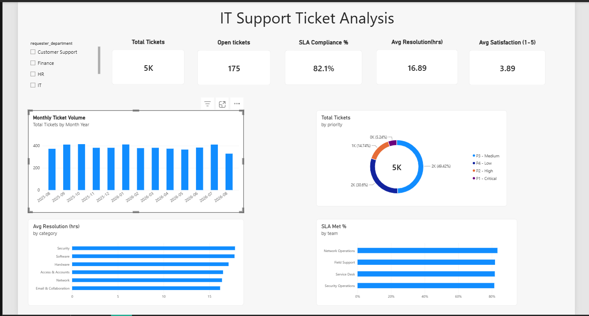

# IT Support Ticket Analysis & Weekly Automated Reporting

End-to-end data analytics project: from raw ticket data in **PostgreSQL** to an interactive **Power BI** dashboard, plus an automated weekly email report built with **Power Automate**.

## Business Question

An IT support team receives thousands of tickets. The support manager wants to know:

- Are we meeting our SLA targets?
- How long do we need to resolve tickets, per priority?
- Which priorities and channels need attention?

## Tech Stack

| Layer | Tool | Purpose |
|-------|------|---------|
| Database | PostgreSQL (+ DBeaver) | Data storage, KPI queries (GROUP BY, CASE WHEN, CTE) |
| ETL | Power Query | Connection, cleaning, deduplication, custom columns |
| Modeling & BI | Power BI (DAX) | Star schema, measures, interactive dashboard |
| Automation | Power Automate | Scheduled weekly report email (cloud flow) |

## Pipeline Overview

### 1. Data layer — PostgreSQL
Two tables: `tickets` (5,000 rows) and `agents` (12 rows). KPIs calculated directly in SQL using `GROUP BY`, conditional aggregation with `CASE WHEN`, and CTEs with `DATE_TRUNC` for monthly trends. Full schema and queries: [`it_support_queries.sql`](it-support-project/it_support_queries.sql)

### 2. Cleaning — Power Query
Connected to PostgreSQL (Import mode), then:
- Removed duplicates: **5,040 → 5,000 rows** (40 duplicate ticket IDs)
- Fixed inconsistent category spelling with **Trim + Capitalize** (~8% of rows)
- Handled missing `channel` values (kept as `null`, excluded from channel analysis)
- Added custom column `sla_met`:
  ```
  if [resolution_hours] = null then null
  else if [resolution_hours] <= [sla_target_hours] then 1 else 0
  ```
  Open tickets have no resolution time yet, so their SLA stays blank — not counted as 0.

### 3. Modeling & Dashboard — Power BI
Star schema: `tickets` = fact table, `agents` = dimension table, many-to-one relationship, single filter direction.

**DAX measures:**
```dax
Total Tickets = COUNTROWS(tickets)

SLA Met % = DIVIDE(
    SUM(tickets[sla_met]),
    COUNT(tickets[sla_met]),
    0
)

Avg Resolution (hrs) = AVERAGE(tickets[resolution_hours])

Open Tickets = CALCULATE(
    COUNTROWS(tickets),
    tickets[status] IN { "Open", "In Progress" }
)

Avg CSAT = AVERAGE(tickets[satisfaction_score])

Month Year = FORMAT(tickets[opened_at], "YYYY-MM")   -- + numeric sort key
```

Dashboard: 5 KPI cards, monthly ticket trend, priority donut chart, resolution-hours by priority, ticket volume by channel, slicers for status and priority.

### 4. Automation — Power Automate
Scheduled cloud flow:
1. **Recurrence** trigger — every Monday at 09:00 (Europe/Warsaw)
2. **Send an email (V2)** — weekly KPI summary sent to the support manager

Tested manually — report delivered successfully.

## Key Results

| KPI | Value |
|-----|-------|
| Total Tickets | 5,000 |
| SLA Met | 82.1% |
| Avg Resolution Time | 16.9 hours |
| Open Tickets | 175 |
| Avg CSAT | 3.89 / 5 |

Priority mix: P3 46%, P4 31%, P2 15%, P1 5%.

## Cross-Validation (SQL vs Power BI)

| Version | SLA | Why |
|---------|-----|-----|
| SQL on raw data (incl. 40 duplicates) | 82.6% | Raw count, duplicates included |
| Power BI on clean data | 82.1% | Duplicates removed |

The difference is exactly the duplicates. Both numbers are correct — they just answer slightly different questions. Lesson learned: always know which version of the truth you are reporting.

## Data Quality Notes (intentional, for practice)

The dataset was designed to contain realistic problems:

- 40 duplicate rows (removed in Power Query)
- ~8% inconsistent category casing (fixed with Trim/Capitalize)
- ~163 missing `channel` values (kept as null)
- `resolution_hours` is null for open tickets (~175 rows) → excluded from SLA and resolution averages
- ~20% missing `satisfaction_score` → Avg CSAT is based on available responses

## Repository Files

| File | Description |
|------|-------------|
| `it-support-project/tickets.csv` | 5,040 raw rows (includes 40 intentional duplicates — cleaning exercise) |
| `it-support-project/agents.csv` | 12 support agents (dimension table) |
| `it-support-project/data_dictionary.txt` | Column definitions for both files |
| `it-support-project/it_support_queries.sql` | Schema creation, data load checks, cleaning, KPI queries |
| `it-support-project/it_support_ticket_dashboard.png` | Power BI dashboard screenshot |

## How to Reproduce

1. Create a PostgreSQL database `it_support` and import both CSVs (DBeaver → import, then fix empty strings: `UPDATE tickets SET channel = NULL WHERE channel = '';`)
2. In Power BI: Get Data → PostgreSQL → Import mode
3. Apply the cleaning steps listed above in Power Query
4. Build the relationship (agents → tickets, many-to-one, single direction) and the DAX measures
5. Recreate the flow in Power Automate: Recurrence trigger (Monday 09:00) → Send an email (V2)

## Screenshots

### Power BI Dashboard


*(Power Query cleaning steps and Power Automate flow screenshots )*


---

*Built as a portfolio project for a Junior Data Analyst application. Warsaw, 2026.*
